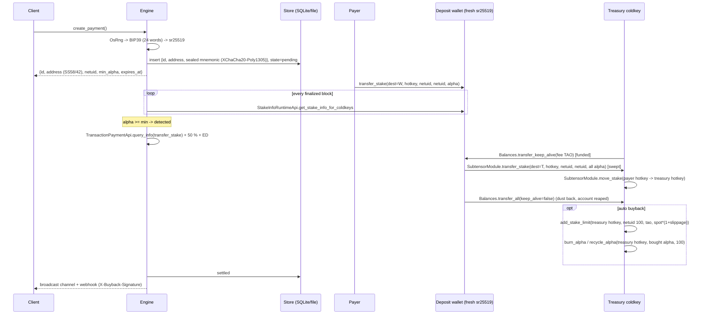
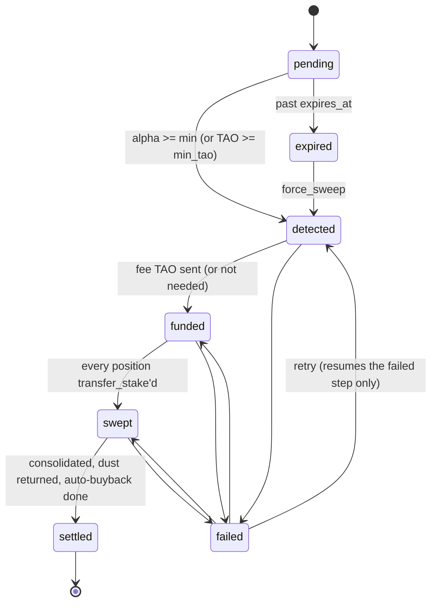

# bittensor-buyback

Take Bittensor **subnet alpha payments** on fresh one-time deposit wallets, **sweep** them into a
treasury automatically, and use treasury TAO for **buybacks**. A buyback buys alpha on a subnet
(netuid 100 by default) and can then burn it.

* A **library** (`Engine`) with a persistent, restart-safe state machine.
* A **CLI** (`buyback`) to create requests, check status, run the watcher and do buybacks.
* An optional **HTTP handler** (`http` feature, axum) and **HMAC-signed webhooks** (`webhook` feature).

Built on [`subxt`] 0.51 and driven by runtime metadata, so there is no generated code to go stale.
Every call and event name is checked against the connected runtime at startup
(`buyback verify-metadata`).

> **Mainnet.** Nothing in this repo has touched mainnet funds. It was tested on a local subtensor
> and checked read-only against finney and testnet. The CLI refuses `finney` unless you pass
> `--allow-mainnet`. Read [Security model](#security-model) and [Mainnet checklist](#mainnet-checklist) first.

## Flow



Each arrow into the chain is an extrinsic. The engine waits for **finalization** and checks the
expected event: `Balances.Transfer`, `StakeTransferred`, `StakeMoved`, `StakeAdded`,
`AlphaBurned` or `AlphaRecycled`. An `ExtrinsicFailed` counts as a failure.

### State machine



Each step does at most one chain action, and the state is written before the next action starts.
After `max_attempts` failures (exponential backoff, 5 s to 10 min) a payment goes to `failed`, and
`retry` sends it back into the step it failed in.

## No double spend, restart safety

Every extrinsic goes through the same **journal-before-broadcast** protocol:

1. Build and sign the transaction with an explicit nonce, **mortal for 64 blocks**.
2. Write `pending = {action, signer, nonce, tx_hash, birth_block}` to the record. The write is a
   compare-and-swap on the record version, so a second engine on the same store loses the race.
3. Broadcast and wait for finalization. Apply the events and clear `pending` in one write.

A record that still has `pending` takes no new action. After a crash, timeout or RPC error, the
entry is resolved from **finalized chain state**:

| on-chain nonce of signer | our tx hash found in blocks `birth..birth+64` | outcome |
|---|---|---|
| > journaled nonce | yes | apply its events (success) or count a failure (`ExtrinsicFailed`) |
| <= journaled nonce | - | past the mortality window: **dead**, rebuild the step; otherwise wait |
| > journaled nonce | no  | nonce used by another tx; dead once past the window |

This is why the treasury can never fund the same step twice, and why a buyback that is part of a
payment cannot be sent twice. `transfer_stake` moves the live alpha amount read just before
signing, so a stale replay would fail on chain with `NotEnoughStakeToWithdraw`.

The localnet test covers this directly. It sends the funding transfer, "crashes" before recording
it, starts a new engine on the same store, and asserts the payment settles with the fee sent
**exactly once**.

Standalone `buyback*()` calls are *not* journaled. They are operator actions. If one errors,
check `buyback balances` before running it again.

## Static deposit addresses

For "one permanent address per account" integrations, wallets are derived instead of generated:

- `DerivationSeed::from_phrase(mnemonic)` holds the master seed (from secret config, never stored).
  `seed.wallet("//app//deposit//<index>")` does sr25519 HDKD with hard junctions only (soft or
  malformed paths are refused). The same mnemonic and index always give the same key, so every
  address can be rebuilt from the mnemonic plus the index range after total data loss.
- `Chain::deposits_in_block(number, &watched)` returns every `StakeAdded` that landed on a watched
  coldkey in a successful signed extrinsic, with `(block_hash, event_index)` as a natural
  idempotency key, the signer, and the block's spot and moving price.
- `Engine::with_seed(seed).create_sweep_job(id, path, expected_address, meta)` re-derives the wallet,
  refuses a mismatching address, and runs the usual fund / sweep / consolidate / buyback state
  machine. Alpha emitted after a sweep stays as dust and is picked up by the next job.

Sealed secrets carry a key id: `Keyring::parse("k1:<hex>,k2:<hex>", "k2")` opens either key and
seals with the active one; `Keyring::reseal` rotates a stored secret.

## RPC endpoints and auth

`Endpoint::new(url).with_bearer(key)` sends `Authorization: Bearer <key>` on the WebSocket
handshake (the key is redacted in `Debug` and in errors). `Chain::connect_any(&endpoints, attempts)`
tries each endpoint in order with backoff. Plaintext `ws://` is refused except on loopback.
Read-only probe: `BITTENSOR_RPC_URL=wss://... BITTENSOR_RPC_API_KEY=... cargo run --example
verify_metadata -- finney 100`.

## Library API

```rust,no_run
use bittensor_buyback::*;
use std::sync::Arc;
# async fn f() -> Result<()> {
let chain = Chain::connect(Network::Finney.url()).await?;
chain.verify_metadata().await?;                       // fail fast on runtime drift
let store: Arc<dyn Store> = Arc::new(SqliteStore::open("buyback.sqlite")?);
let master = MasterKey::from_env("BUYBACK_MASTER_KEY")?;
let treasury = TreasuryKeySource::EncryptedKeystore("treasury.json".into()).load(Some(&master))?;
let mut cfg = Config::new(Network::Finney.url(), 42 /* payment netuid */,
                          keys::parse_ss58("5...treasury hotkey")?);
cfg.auto = AutoBuyback::On { destroy: Destroy::Burn, amount: AutoAmount::PaymentValueBps(10_000) };
let engine = Arc::new(Engine::new(chain, store, master, treasury, cfg));
engine.ensure_treasury_hotkey().await?;               // try_associate_hotkey if missing

let req: PaymentRequest = engine.create_payment(CreatePayment::default())?;
let status: PaymentStatus = engine.status(&req.id)?;
let mut settled = engine.subscribe();                 // in-process callback
tokio::spawn({ let e = engine.clone(); async move { e.run().await } });

engine.buyback(units::parse_amount("10")?).await?;          // buy, keep staked
engine.buyback_and_burn(units::parse_amount("10")?).await?; // buy, burn_alpha
engine.buyback_and_recycle(units::RAO_PER_TAO).await?;      // buy, recycle_alpha
engine.buyback_all(Destroy::Burn).await?;                   // whole balance - fee_reserve
# Ok(()) }
```

| item | purpose |
|---|---|
| `Engine::create_payment(CreatePayment) -> PaymentRequest` | new wallet + request `{id, address, netuid, min_alpha, min_tao, expires_at}` |
| `Engine::status(id) -> PaymentStatus` | public view (never contains secrets) |
| `Engine::run()` / `Engine::tick()` | follow finalized blocks / one pass |
| `Engine::subscribe()` | `broadcast::Receiver<PaymentStatus>` for settled/failed/expired |
| `Engine::retry(id)`, `Engine::force_sweep(id)` | operator recovery |
| `Engine::buyback`, `buyback_and_burn`, `buyback_and_recycle`, `buyback_all`, `buyback_with` | treasury buybacks, return `BuybackReceipt` |
| `Engine::ensure_treasury_hotkey()` | create the treasury hotkey account if missing |
| `Chain` | `verify_metadata`, `stake_positions`, `alpha_price`, `estimate_fee`, `submit`, `find_pending` |
| `Store` trait, `SqliteStore`, `FileStore`, `open_store("sqlite:..."/"file:...")` | persistence with compare-and-swap |
| `MasterKey`, `PaymentWallet`, `TreasuryKeySource` | key custody |
| `units::{parse_amount, format_amount, buy_limit_price, funding_needed}` | integer rao math |

All amounts are **`u64` rao**: 1 TAO = 1 alpha = 1e9 rao.

## CLI

```sh
cargo install --path .                     # features: sqlite (default), http, webhook
export BUYBACK_MASTER_KEY=$(buyback gen-master-key)          # keep in your secret manager
export BUYBACK_TREASURY_URI="<treasury mnemonic>"            # or --treasury-keystore / --treasury-mnemonic-file
buyback seal-treasury treasury.json                          # optional: encrypted keystore instead of raw env
buyback verify-metadata --network finney                     # read-only
export BUYBACK_NETWORK=local BUYBACK_NETUID=2 BUYBACK_TREASURY_HOTKEY=5...
buyback create --metadata '{"order":123}'
buyback status <id>
buyback run --listen 127.0.0.1:8080      # watcher + HTTP (http feature)
buyback buyback 10 --then burn           # or `all`, --then keep|burn|recycle
buyback balances
```

Every flag has an env var; `buyback <cmd> --help` lists them.

### HTTP (`--features http`)

* `POST /payments` with `{"min_alpha"?, "expiry_secs"?, "metadata"?, "callback_url"?}` returns `201` + `PaymentRequest`
* `GET /payments/{id}` returns `PaymentStatus`
* `GET /health`

There is no auth layer. Bind to localhost or a private network, or put it behind your gateway.

### Webhooks (`--features webhook`)

When a payment settles, the engine `POST`s its `PaymentStatus` JSON to `callback_url` (per request)
or `BUYBACK_WEBHOOK_URL`, with `X-Buyback-Signature: sha256=<hex HMAC-SHA256(BUYBACK_WEBHOOK_SECRET, body)>`.
Failed deliveries are retried every 30 s until they succeed. Delivery is at least once, so
receivers must deduplicate on `id`.

## Configuration

| `Config` field | env (CLI) | default | notes |
|---|---|---|---|
| `url` | `BUYBACK_NETWORK` | `local` | `finney` = `wss://entrypoint-finney.opentensor.ai:443`, `test` = `wss://test.finney.opentensor.ai:443`, `local` = `ws://127.0.0.1:9944`, or any `ws(s)://` |
| `netuid` | `BUYBACK_NETUID` | - | payment subnet |
| `min_alpha` | `BUYBACK_MIN_ALPHA` | 1 alpha | |
| `min_tao` | `BUYBACK_MIN_TAO` | off | also accept plain TAO payments |
| `expiry_secs` | `BUYBACK_EXPIRY_SECS` | 86400 | |
| `treasury_hotkey` | `BUYBACK_TREASURY_HOTKEY` | - | where swept and bought stake lives |
| `consolidate` | - | true | `move_stake` swept alpha onto `treasury_hotkey` |
| `return_dust` | - | true | `transfer_all` leftover TAO back, reaping the account |
| `sweep_dust` | - | 0.001 alpha | positions below `max(sweep_dust, 1.5 x min stake at spot)` are not swept |
| `fee_margin_bps` | `BUYBACK_FEE_MARGIN_BPS` | 5000 (+50 %) | on top of `query_info` |
| `fee_reserve` | `BUYBACK_FEE_RESERVE` | 0.1 TAO | kept by `buyback_all` |
| `buyback_netuid` | `BUYBACK_NETUID_TARGET` | **100** | |
| `slippage_bps` | `BUYBACK_SLIPPAGE_BPS` | 100 (1 %) | `limit_price = spot * (1 + bps/1e4)` |
| `allow_partial` | - | false | fill-or-kill by default |
| `auto` | `BUYBACK_AUTO` / `BUYBACK_AUTO_AMOUNT` | off | `keep`/`burn`/`recycle` x `all` / `payment` (spot value of the swept alpha) / fixed amount |
| `max_attempts` | - | 8 | |

Treasury coldkey sources (`TreasuryKeySource`): `EnvUri` (mnemonic or secret URI in an env var),
`MnemonicFile`, and `EncryptedKeystore` (sealed with the master key, created by `seal-treasury`).

## Fees

* **Fee estimate.** `TransactionPaymentApi_query_info` on the exact signed `transfer_stake` the
  wallet will send. Subtensor's balance type is a `u64`, so the crate decodes `RuntimeDispatchInfo`
  itself: subxt's `partial_fee_estimate` assumes `u128` and fails on subtensor.
* **Funding.** `need = ceil(fee * (1 + margin)) + existential_deposit - current_free`. The ED is
  included because fees are withdrawn with `Preservation::Preserve`. On localnet this came to
  0.001104787 TAO.
* **Dust.** Anything left after the sweep goes back to the treasury with
  `transfer_all(keep_alive = false)`, which reaps the account.
* **Fees paid in alpha.** Current subtensor can take `transfer_stake`/`burn_alpha` fees in alpha
  when the signer has no TAO (`SubtensorTxFeeHandler::fees_in_alpha`). The engine still funds TAO
  so the full payment reaches the treasury and the fee cost is predictable.
* **Buybacks** are priced with `SwapRuntimeApi_current_alpha_price` (rao per alpha). The order is
  `add_stake_limit(limit_price = spot * (1 + slippage))`, so if the pool moves past the limit it
  fails (`SlippageTooHigh`) instead of filling at a bad price.

## `burn_alpha` vs `recycle_alpha`

Both are `SubtensorModule` extrinsics signed by the coldkey. Each removes up to `amount` alpha
from the `(coldkey, hotkey, netuid)` stake (capped at what is available). The difference is how
subnet issuance is tracked
([`recycle_alpha.rs`](https://github.com/opentensor/subtensor/blob/main/pallets/subtensor/src/staking/recycle_alpha.rs),
[`coinbase/alpha.rs`](https://github.com/opentensor/subtensor/blob/main/pallets/subtensor/src/coinbase/alpha.rs)):

| | `burn_alpha` (call 102, event `AlphaBurned`) | `recycle_alpha` (call 101, event `AlphaRecycled`) |
|---|---|---|
| stake removed | yes | yes |
| `SubnetAlphaOut` (alpha in circulation) | **unchanged** | **decreased** |
| `AlphaAssets.TotalAlphaIssuance` | unchanged, `AlphaBurned` counter += amount | **decreased**, `AlphaRecycled` counter += amount |
| effect | alpha is permanently destroyed and counted as burned supply. Issuance keeps counting it, so the emission schedule (which follows issuance) is unaffected | alpha goes back to the "unissued" pool: issuance and outstanding supply shrink, so it can be emitted again |

For a "buy and burn" that permanently removes supply and shows up as burned, use `burn_alpha`,
which is what `buyback_and_burn` does. `buyback_and_recycle` and `Destroy::Recycle` are there if
you want the alpha returned to future emissions instead. Neither can be undone. Neither works on
the root subnet (`CannotBurnOrRecycleOnRootSubnet`), and the hotkey must exist on chain.

## Security model

* **Key generation.** `OsRng` (`getrandom`, the kernel CSPRNG) gives 256 bits of entropy, which
  become a BIP39 24-word mnemonic and then an sr25519 keypair (`subxt-signer`/schnorrkel). There
  is one wallet per request and wallets are never reused.
* **Secrets in memory.** Mnemonics, master keys and entropy live in `zeroize::Zeroizing` buffers.
  `PaymentWallet`, `MasterKey` and `SealedSecret` have redacting `Debug` impls and no
  `Display`/`Serialize` for plaintext. Tests assert that `Debug` output never contains the phrase.
  (The sr25519 expanded key inside `schnorrkel` is zeroized by that crate on drop.)
* **Secrets at rest.** XChaCha20-Poly1305 with a 256-bit master key and a random 192-bit nonce per
  seal. The associated data is `bittensor-buyback/v1/<payment id>/<address>`, so a ciphertext
  moved to another row fails to decrypt. When a wallet is unsealed, its derived address is checked
  against the record. The file store writes 0600 files in a 0700 directory, atomically (tmp +
  fsync + rename).
* **Master key.** Loaded from an env var (64 hex chars). For KMS or Vault, decrypt a data key in
  your entrypoint and pass it with `MasterKey::from_bytes`. Losing the master key means losing
  every unswept deposit wallet, so back it up. Rotation is not implemented: sweep everything, then
  switch keys.
* **Treasury key.** The treasury key is the hot wallet: it signs fee funding, consolidation and
  buybacks. Keep only working capital on it. `fee_reserve` limits what `buyback_all` can spend.
* **Threats.**
  * A store leak without the master key exposes addresses only.
  * A leak of the master key and the store exposes unswept deposits. Wallets are emptied within a
    few blocks of payment.
  * A compromised host exposes everything the process can sign with, which is inherent to hot
    wallets.
  * The HTTP API has no auth, so do not expose it publicly. Anyone who can reach it can create
    requests (cheap: no chain writes) and read statuses.
  * Webhook receivers must verify `X-Buyback-Signature`.
* **Chain trust.** The engine trusts the RPC node it connects to. Use your own node, or at least
  a trusted endpoint. Everything is read at the **finalized** head.
* **Payer hotkey.** The payer picks the hotkey their stake sits on. The sweep keeps that hotkey
  and `move_stake` consolidates onto yours. Until then the alpha earns (or loses) under the payer's
  validator.

## Tests

```sh
cargo test --all-features                 # unit tests: keygen, crypto, state machine, stores, fee/slippage math, SCALE decoding
docker run -d -p 9944:9944 ghcr.io/opentensor/subtensor-localnet:devnet-ready True   # fast blocks
cargo test --all-features --features localnet-tests --test localnet -- --nocapture
```

The localnet test registers two subnets (a payment subnet, and a buyback subnet standing in for
netuid 100, which does not exist on a fresh localnet). //Alice buys alpha and `transfer_stake`s 2
alpha to a fresh deposit address. The test then checks:

* detection, fee funding, sweep, consolidation, dust return and auto buyback-and-burn, with
  balances before and after;
* a simulated restart mid-flow;
* a crash-after-broadcast recovery that must not fund twice;
* `buyback`, `buyback_and_burn` and `buyback_and_recycle`, with their balance and event deltas;
* the fee-reserve guard.

It only uses well-known dev accounts (`//Alice`, `//Bob` and their derivations). CI runs it
against the localnet image as a service container.

## Mainnet checklist

1. Run `buyback verify-metadata --network finney` and confirm every call and event resolves.
2. Generate the master key and store it in your secret manager. Seal the treasury mnemonic into a
   keystore (`seal-treasury`).
3. Pick the treasury hotkey. Either use a hotkey you own and have registered, or let
   `ensure_treasury_hotkey` run `try_associate_hotkey`. It must not be a subnet system account.
4. Fund the treasury coldkey with working TAO for fees, and set `fee_reserve`.
5. Start with `auto = off` and a small `min_alpha`. Do one real payment, check `buyback status`,
   then enable auto-buyback.
6. Run `buyback run` under a supervisor, with backups of the SQLite file. Also back up the master
   key: losing it strands any unswept deposits.
7. Run with `--allow-mainnet`. Review `slippage_bps` against the netuid 100 pool depth, since
   large buys move the price.

## License

MIT OR Apache-2.0.

[`subxt`]: https://github.com/paritytech/subxt
